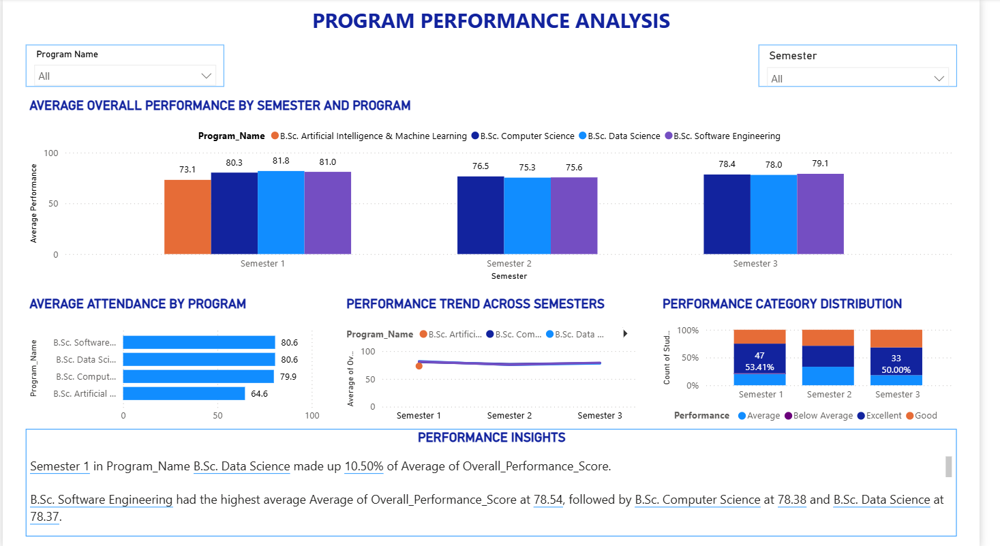
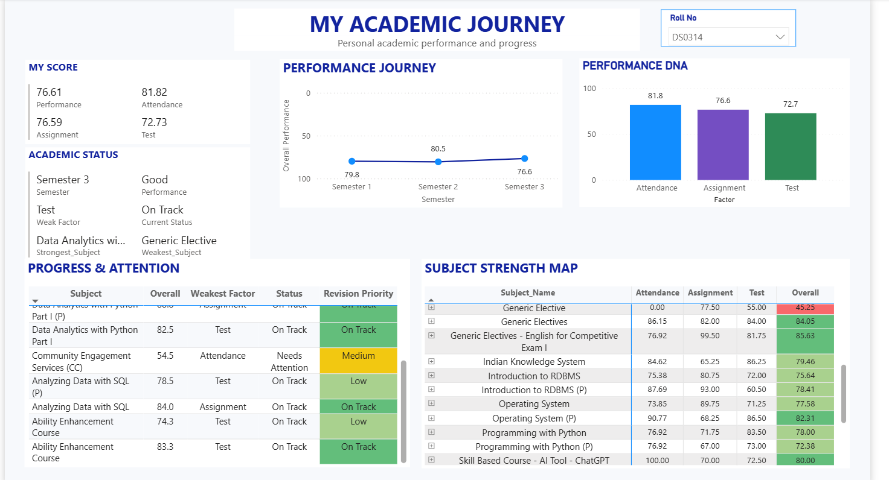

# Student Performance Management & Analysis System

A role-based web application for managing and analysing student academic performance.

## Project Overview

This project manages student academic data through a Flask-based web application and MySQL database, followed by Python/Pandas-based data processing and Power BI reporting.

The project follows an end-to-end data flow:

Application → MySQL → ETL & Data Processing → Analysis → Power BI → Insights

## Key Features

- Role-based Admin, Teacher and Student modules
- Student management
- Subject management
- Attendance management
- Assignment management
- Test management
- Student performance analysis
- Subject-wise performance analysis
- Program-wise performance analysis
- Semester-wise performance analysis
- Teacher subject performance analysis
- Student academic journey analysis
- Performance categories and revision/attention areas
- Interactive Power BI dashboards

## Data Analysis & ETL

Python and Pandas are used to process data extracted from the MySQL database.

The analysis pipeline includes:

- Data extraction
- Data cleaning
- Data transformation
- Data aggregation
- Performance calculations
- Student-level analysis
- Subject-level analysis
- Program and semester-level analysis
- Preparation of analysis-ready datasets for Power BI

## Performance Analysis

Student performance is analysed using:

- Attendance
- Assignment performance
- Test performance
- Overall performance
- Subject-wise performance
- Semester-wise progress
- Performance categories
- Revision and attention areas

## Power BI Dashboards

The processed data is visualized through Power BI dashboards for:

- Admin / Program Performance
- Student Academic Journey
- Teacher Subject Analysis

## Power BI Dashboard Screenshots

The project includes Power BI dashboards developed from the analysis-ready datasets generated through the Python and Pandas pipeline.

### Admin – Academic Overview


### Program Performance



### Student Performance



### Teacher – Subject Performance


## Technology Stack

- Python
- Pandas
- Flask
- MySQL
- Power BI
- HTML
- CSS
- JavaScript
- Bootstrap

## Project Structure

```text
student-performance-system/
│
├── app.py
├── auto_pipeline.py
├── requirements.txt
├── README.md
├── .gitignore
│
├── analysis/
├── cleaning/
├── routes/
├── templates/
├── static/
│
└── data/